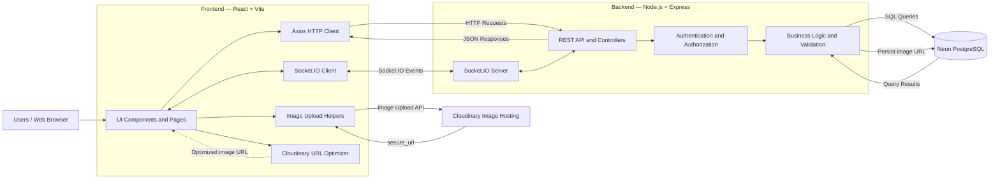

# Seamless-Chat

A full-stack, real-time messaging application built with React, Node.js, Express, PostgreSQL, and Socket.IO.

Seamless-Chat brings direct messaging, friendships, community-based conversations, text channels, and real-time user presence into a single web application.

## Overview

Seamless-Chat is a full-stack project focused on building a real-time communication experience with a clear separation between frontend presentation, backend business logic, persistent data, and real-time event delivery.

The application uses REST APIs for authenticated operations and message persistence, Socket.IO for real-time updates, PostgreSQL for relational data, and Cloudinary for image hosting.

## Features

### Authentication and Account Management

- User registration and login.
- JWT-based authentication using HTTP-only cookies.
- Short-lived access tokens and refresh tokens.
- Refresh-token rotation and revocation.
- Protected routes and authenticated API endpoints.
- Profile management, including username, password, and avatar updates.
- Authentication-aware API requests and refresh handling.

### Direct Messaging

- Start direct conversations with friends.
- Send and receive messages in real time.
- Persist message history in PostgreSQL.
- Load older messages through pagination.
- Track conversation read positions and unread messages.
- Keep conversation loading separate from friend-list pagination.

### Friends and Social Features

- Search and browse users.
- Send and manage friend requests.
- View friends, pending requests, and blocked users.
- Manage blocking relationships.
- Display user presence and status changes.

### Communities and Channels

- Browse and search public communities.
- Join communities and access their channels.
- Join a community using an invite code.
- Manage community details and icons where authorized.
- Create, rename, and delete channels subject to application rules.
- View community members and roles.
- Send and receive messages in text channels.
- Track channel read states and unread messages.

### Real-Time Updates

Socket.IO delivers application updates to connected clients, including:

- Incoming direct messages and channel messages.
- User presence and status changes.
- Friend and pending-request updates.
- Block-list updates.
- Conversation updates.
- Community and channel updates.
- Member-list updates.
- Unread-message notifications.

Message creation is handled through the REST API. The backend persists a message before broadcasting it through Socket.IO, keeping database writes separate from real-time delivery.

### Image Uploads and Optimization

Cloudinary handles image hosting for user avatars and community/server icons.

- Upload images directly from the frontend.
- Validate image MIME type and file size before upload.
- Enforce a 5 MB client-side file-size limit.
- Receive the image's `secure_url` after a successful upload.
- Send the resulting URL to the backend when updating the associated profile or community.
- Generate optimized Cloudinary image URLs with configurable dimensions, cropping, quality, format, and device pixel ratio.

### Security and Reliability

- HTTP-only authentication cookies.
- Protected API endpoints.
- Refresh-token rotation and revocation.
- Request rate limiting.
- Security headers through Helmet.
- Credentialed CORS configuration.
- Server-side validation and authorization for protected operations.

> **Current scope:** Voice channels may appear in the application structure, but working voice chat has not been implemented.

## Tech Stack

| Area             | Technologies                        |
| ---------------- | ----------------------------------- |
| Frontend         | React 19, Vite 7                    |
| Routing          | React Router 7                      |
| Styling          | Tailwind CSS 4                      |
| HTTP client      | Axios                               |
| Real-time client | Socket.IO Client                    |
| Forms            | React Hook Form                     |
| Animations       | Framer Motion                       |
| Icons            | React Icons                         |
| Notifications    | Sonner                              |
| Backend          | Node.js, Express 5                  |
| Database         | PostgreSQL, `pg`                    |
| Real-time server | Socket.IO                           |
| Authentication   | JSON Web Token, `bcryptjs`, cookies |
| Security         | Helmet, CORS, `express-rate-limit`  |
| Background tasks | `node-cron`                         |
| Image hosting    | Cloudinary                          |
| Database hosting | Neon                                |
| Deployment       | Render                              |
| Version control  | Git, GitHub                         |

## Architecture

Seamless-Chat separates the user interface, backend application logic, real-time communication, database persistence, and image hosting.



### Component Responsibilities

**Frontend — React and Vite**

- Renders the application interface and manages client-side state.
- Uses React Router for navigation and protected routes.
- Uses Axios to communicate with the backend REST API.
- Uses Socket.IO Client to receive real-time messages and application updates.
- Uploads avatars and community/server icons to Cloudinary.
- Uses Cloudinary transformation URLs to optimize displayed images.

**Backend — Node.js and Express**

- Exposes REST endpoints for authentication, users, conversations, messages, communities, and channels.
- Applies authentication, authorization, validation, and business rules.
- Executes PostgreSQL queries through `pg`.
- Persists messages before emitting real-time message events.
- Coordinates Socket.IO rooms and broadcasts.
- Handles rate limiting and HTTP security configuration.

**Neon PostgreSQL**

- Stores application data, including users, friendships, conversations, messages, communities, channels, membership relationships, and read-state information.
- Provides persistent relational storage accessed by the backend through `DATABASE_URL`.

**Cloudinary**

- Stores uploaded avatar and community/server icon images.
- Returns a `secure_url` after successful uploads.
- Supports image transformations for optimized delivery.

Cloudinary is a separate image-hosting service. The frontend uploads image files directly to Cloudinary; the backend stores the corresponding image URL when the application updates the relevant record.

### Message Flow

1. A user sends a direct message or channel message from the frontend.
2. Axios sends the request to the backend REST API.
3. The backend authenticates the user and validates access to the target conversation or channel.
4. The backend writes the message to PostgreSQL.
5. After a successful write, the backend broadcasts the message through Socket.IO to the relevant recipients.
6. Connected clients update the conversation or channel interface.

### Image Upload Flow

1. The user selects an avatar or community/server icon.
2. The frontend validates the file type and checks the 5 MB size limit.
3. The upload helper sends the file and Cloudinary upload preset to Cloudinary.
4. Cloudinary returns a `secure_url`.
5. The frontend sends the URL to the backend through the appropriate update operation.
6. The backend updates the corresponding database record.
7. The frontend displays the image, optionally using a Cloudinary transformation URL.

## Project Structure

```text
Seamless-Chat/
├── Backend/
│   ├── src/
│   │   ├── config/
│   │   │   └── db.js
│   │   ├── controllers/
│   │   │   ├── authController.js
│   │   │   ├── messageController.js
│   │   │   ├── serverController.js
│   │   │   └── userController.js
│   │   ├── database/
│   │   │   ├── schema.sql
│   │   │   └── seed.sql
│   │   ├── middleware/
│   │   │   ├── authMiddleware.js
│   │   │   └── rateLimiter.js
│   │   ├── utils/
│   │   │   └── cleanupTokens.js
│   │   ├── server.js
│   │   └── socket.js
│   ├── package.json
│   └── .env
│
├── Frontend/
│   ├── src/
│   │   ├── api/
│   │   ├── assets/
│   │   ├── components/
│   │   ├── hooks/
│   │   ├── pages/
│   │   ├── utils/
│   │   ├── main.jsx
│   │   ├── routes.jsx
│   │   └── style.css
│   ├── package.json
│   ├── vite.config.js
│   └── .env
│
├── package.json
├── package-lock.json
├── .gitignore
└── README.md
```

## Getting Started

### Prerequisites

- Node.js and npm.
- PostgreSQL, either locally or through a hosted provider such as Neon.
- A Cloudinary account for image uploads.
- Git.

### 1. Clone the Repository

```bash
git clone https://github.com/duchieu2312/Seamless-Chat.git
cd Seamless-Chat
```

### 2. Install Dependencies

Install root dependencies:

```bash
npm install
```

Install backend dependencies:

```bash
cd Backend
npm install
cd ..
```

Install frontend dependencies:

```bash
cd Frontend
npm install
cd ..
```

### 3. Configure Environment Variables

Create a `.env` file in both the `Backend/` and `Frontend/` directories.

#### Backend — `Backend/.env`

```env
PORT=5000
DATABASE_URL=your_postgresql_connection_string
JWT_SECRET=your_access_token_secret
REFRESH_SECRET=your_refresh_token_secret

# Set this to your deployed frontend origin in production.
# CLIENT_URL=https://your-frontend-domain
```

| Variable         | Description                                                                            |
| ---------------- | -------------------------------------------------------------------------------------- |
| `PORT`           | Backend port. The application defaults to `5000` when no port is provided.             |
| `DATABASE_URL`   | PostgreSQL connection string.                                                          |
| `JWT_SECRET`     | Secret used to sign access tokens.                                                     |
| `REFRESH_SECRET` | Secret used to sign refresh tokens.                                                    |
| `CLIENT_URL`     | Frontend origin used by the backend's CORS configuration. Configure it for production. |

The active database configuration uses `DATABASE_URL`:

```js
import pg from "pg";

const { Pool } = pg;

const pool = new Pool({
  connectionString: process.env.DATABASE_URL,
});

export default pool;
```

The individual `DB_USER`, `DB_HOST`, `DB_NAME`, `DB_PASSWORD`, and `DB_PORT` variables are not used by this active configuration.

Use a valid connection string for your local PostgreSQL database during development or your Neon database in production.

#### Frontend — `Frontend/.env`

```env
# Configure these when required by your deployment.
# VITE_API_URL=
# VITE_SOCKET_URL=

VITE_CLOUDINARY_CLOUD_NAME=your_cloudinary_cloud_name
VITE_CLOUDINARY_UPLOAD_PRESET=your_cloudinary_upload_preset
```

| Variable                        | Description                                                                            |
| ------------------------------- | -------------------------------------------------------------------------------------- |
| `VITE_API_URL`                  | Backend API base URL. Include `/api` if required by the backend's route configuration. |
| `VITE_SOCKET_URL`               | Backend origin used for the Socket.IO connection, normally without `/api`.             |
| `VITE_CLOUDINARY_CLOUD_NAME`    | Cloudinary cloud name.                                                                 |
| `VITE_CLOUDINARY_UPLOAD_PRESET` | Cloudinary upload preset.                                                              |

The frontend currently has local fallback URLs for the API and Socket.IO connection. Configure the corresponding variables in production when those fallbacks do not point to the deployed services.

Cloudinary configuration is needed to upload avatars and community/server icons.

**Important:** Frontend variables prefixed with `VITE_` are exposed to the browser. Never place database credentials, JWT secrets, refresh-token secrets, or Cloudinary API secrets in frontend environment variables.

### 4. Set Up PostgreSQL

Create a PostgreSQL database and run `Backend/src/database/schema.sql` to create the required tables and schema.

Set `DATABASE_URL` to the connection string of your PostgreSQL database.

For production, configure `DATABASE_URL` with the connection string provided by Neon.

**Note:** Seed data is not included in this repository.

### 5. Start the Application

The root package scripts are configured to use the `Backend` and `Frontend` directory names.

From the repository root, run:

```bash
npm run dev
```

This starts the backend and frontend development processes through the root script.

If you prefer to run them separately, open two terminals.

**Terminal 1 — Backend**

```bash
cd Backend
npm run dev
```

**Terminal 2 — Frontend**

```bash
cd Frontend
npm run dev
```

Open the frontend URL printed by Vite in the terminal. The default local URL is typically `http://localhost:5173`.

### 6. Available Scripts

#### Root

| Command          | Description                                   |
| ---------------- | --------------------------------------------- |
| `npm run server` | Starts the backend development script.        |
| `npm run client` | Starts the frontend development server.       |
| `npm run dev`    | Runs both development processes concurrently. |

#### Backend

Run these commands from `Backend/`.

| Command       | Description                                       |
| ------------- | ------------------------------------------------- |
| `npm run dev` | Starts the backend with Nodemon and loads `.env`. |
| `npm start`   | Starts the backend with Node.js and loads `.env`. |

#### Frontend

Run these commands from `Frontend/`.

| Command           | Description                            |
| ----------------- | -------------------------------------- |
| `npm run dev`     | Starts the Vite development server.    |
| `npm run build`   | Builds the frontend for production.    |
| `npm run preview` | Previews the production build locally. |
| `npm run lint`    | Runs ESLint.                           |

## Deployment

The application uses separate frontend and backend services, with Neon PostgreSQL as the database and Cloudinary for image hosting.

### Frontend — Render

Configure a frontend web service using `Frontend/` as its root directory.

Typical build settings:

- **Build command:** `npm install && npm run build`
- **Publish directory:** `dist`

Configure the frontend environment variables:

- `VITE_API_URL`
- `VITE_SOCKET_URL`
- `VITE_CLOUDINARY_CLOUD_NAME`
- `VITE_CLOUDINARY_UPLOAD_PRESET`

Set the API and Socket.IO URLs to the deployed backend. The API URL should match the backend API path configuration, while the Socket.IO URL should point to the backend origin.

### Backend — Render

Configure a backend web service using `Backend/` as its root directory.

Typical settings:

- **Install command:** `npm install`
- **Start command:** `npm start`

Configure the following environment variables:

- `DATABASE_URL`
- `JWT_SECRET`
- `REFRESH_SECRET`
- `CLIENT_URL`

Render supplies the `PORT` environment variable for the running service. The server should listen on that value.

If Express runs behind a proxy, configure `trust proxy` to match the actual deployment topology, particularly when using IP-based rate limiting.

### Database — Neon

1. Create a PostgreSQL project in Neon.
2. Obtain the database connection string.
3. Configure it as `DATABASE_URL` in the backend service.
4. Apply `schema.sql` and any required seed data.
5. Verify that the deployed backend can connect to the database.

### Production Checklist

- [ ] Frontend points to the deployed API and Socket.IO server.
- [ ] Backend `CLIENT_URL` matches the deployed frontend origin.
- [ ] `DATABASE_URL` points to the intended Neon database.
- [ ] JWT and refresh-token secrets are configured securely.
- [ ] Database schema has been applied.
- [ ] Cloudinary environment variables are configured.
- [ ] Credentialed CORS and cookie behavior work across the deployed domains.
- [ ] Environment files and private credentials are excluded from Git.
- [ ] Authentication, direct messaging, channel messaging, presence, and image uploads have been tested in production.

## Engineering Highlights

Seamless-Chat demonstrates practical full-stack engineering concepts:

- **Authentication:** JWT cookies, access-token expiry, refresh-token rotation, and revocation.
- **Relational data modeling:** users, friendships, conversations, messages, communities, channels, and read states.
- **Real-time architecture:** Socket.IO rooms, event broadcasts, and presence synchronization.
- **Message persistence:** REST API writes followed by real-time broadcasts.
- **Pagination:** incremental loading for messages and user/conversation lists.
- **Unread tracking:** conversation and channel read positions.
- **Security:** authentication middleware, authorization checks, rate limiting, and security headers.
- **Third-party integration:** Cloudinary uploads and Neon PostgreSQL.
- **Deployment:** separate frontend and backend services with environment-based configuration.

## Future Improvements

Potential future improvements include:

- Implementing working voice chat.
- Expanding automated unit and integration test coverage.
- Adding structured logging, monitoring, and error reporting.
- Improving deployment documentation and operational tooling.
